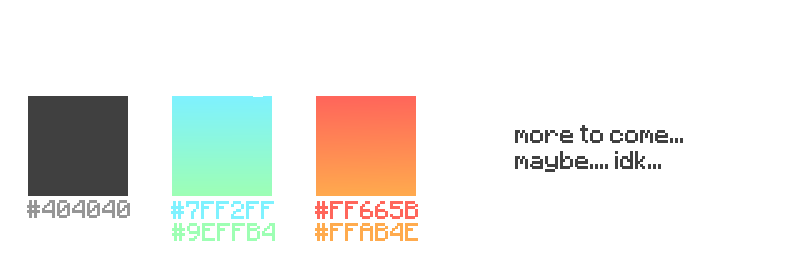

# Carbon
#### by [orbyfied](https://github.com/orbyfied)


Carbon is a server side modloader for Spigot
aiming to provide a way for plugin makers to easily
add new, textured, customizable content without having
to code any client side mods at all. It does this using
a dynamically built resource pack containing all textures
and models and using packets and events for behaviour and 
interaction.

>### [📚 Documentation](https://github.com/orbyfied/carbon/wiki)

## Branding


## Getting Started Modding

### 1 - Include Dependency
Make sure to ***never*** shade the dependency.
Only depend on it at compilation. Carbon should be
loaded at runtime by the Minecraft server as it is
a plugin itself.

### 2 - Create a plugin
Create a Bukkit plugin like you normally would;
Make a main class which extends `JavaPlugin` and
create a `plugin.yml`. Then, append the following to your `plugin.yml`
```yaml
depend:
  - Carbon
```
This will make sure that your plugin/mod loads after
Carbon and won't load if it is not found. This makes
sure your mod will not attempt to load if Carbon is not found.

### 3 - Annotate as mod
Next, we need to tell Carbon that our plugin is actually
a mod that can be loaded. This is done using the `@CarbonMod`
annotation. It takes in an `id`, a `name`, a `version` and an
optional alternate mod initializer class: `initializer`.

If the initializer is left to the default, Carbon will take the
plugin instance and class as the mod initializer. Every initializer needs
to implement `CarbonModInitializer`, if the initializer class does not implement
`CarbonModInitializer`, it will throw an error. 

To get started, change your plugin declaration to:
```java
// indicate that this is a Carbon mod
@CarbonMod(
        id = "example" /* the mod id */ ,
        name = "Example" /* the display name */,
        version = "1.0.0" /* the current version */
)
public class ExampleMod
        extends JavaPlugin /* every mod main class needs to be a bukkit plugin */
```
Then, since we didn't specify an alternate mod initializer,
we will use the plugin as initializer, so add the following to your plugin
class declaration:
```java
implements CarbonModInitializer /* the mod initializer */
```
Then we need to implement the `modInitialize` method.
We will do this in the next section;

### 4 - Implement behaviour
To add behaviour to our mod, we generally need to do some stuff
in `modInitialize`. This method from the mod initializer interface 
provides us with our own mod API (`CarbonModAPI`) which will
provide us with exclusive access to Carbons features.

To get started, override the `modInitialize` method (which is required anyways):
```java
/*
    Called when initializing the mod.
    Part of the mod initializer
 */
@Override
public void modInitialize(CarbonModAPI api) {
    
}
```

Next, we will add everything we need to initialize our behaviour 
inside this block. For this example, we will add a ruby
item with a base material of redstone.

For this, we first need to get the item registry with
```java
final Registry<CarbonItem<?>> itemRegistry = api.getRegistry("minecraft:items");
```

Then we are going to actually create and configure our item:
```java
CarbonItem<?> itemRuby = new CarbonItem<>(
        Identifier.of("example:ruby"), // use your mod id as the namespace
        // we dont need our item to have any custom behaviour
        // so we will just use the default item state
        CarbonItemState.class
)
        .setBaseMaterial(Material.REDSTONE) // set base material
        .setDisplayStrategy(ModelItemDisplayStrategy::new, // create the service that will display our item
                (item, ids) -> ids.setDisplayName("Ruby")) // set the display name of the item
        .build(); // VERY IMPORTANT: build the item
```

Finally, we need to register our item into the item registry;
```java
itemRegistry.register(itemRuby /* our custom item */);
```

### Finally

Finally, the code inside our main class looks like this:
```java
// indicate that this is a Carbon mod
@CarbonMod(
        id = "example" /* the mod id */ ,
        name = "Example" /* the display name */,
        version = "1.0.0" /* the current version */
)
public class ExampleMod
        extends JavaPlugin /* every mod main class needs to be a bukkit plugin */
        implements CarbonModInitializer /* the mod initializer */ {

    /*
        You can set an alternate mod initializer in the mod
        descriptor annotation, the default is the mod class.
        Every mod initializer needs to implement CarbonModInitializer.
     */

    /**
     * Called when initializing the mod.
     * Part of the mod initializer
     */
    @Override
    public void modInitialize(CarbonModAPI api) {
        // get item registry
        final Registry<CarbonItem<?>> itemRegistry = api.getRegistry("minecraft:items");

        // create new item
        CarbonItem<?> ruby = new CarbonItem<>(
                Identifier.of("example:ruby"), // use your mod id as the namespace
                // we dont need our item to have any custom behaviour
                // so we will just use the default item state
                CarbonItemState.class
        )
                .setBaseMaterial(Material.REDSTONE) // set base material
                .setDisplayStrategy(ModelItemDisplayStrategy::new, // create the service that will display our item
                        (item, ids) -> ids.setDisplayName("Ruby")) // set the display name of the item
                .build(); // VERY IMPORTANT: build the item

        // register the new item
        itemRegistry.register(ruby);
    }

}
```