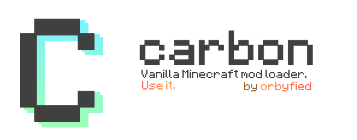

# Carbon
#### by [orbyfied](https://github.com/orbyfied)

Carbon is a server side modloader for Spigot
aiming to provide a way for plugin makers to easily
add new, textured, customizable content without having
to code any client side mods at all. It does this using
a dynamically built resource pack containing all textures
and models and using packets and events for behaviour and 
interaction.

>### [📚 Documentation](https://github.com/orbyfied/carbon/wiki)
